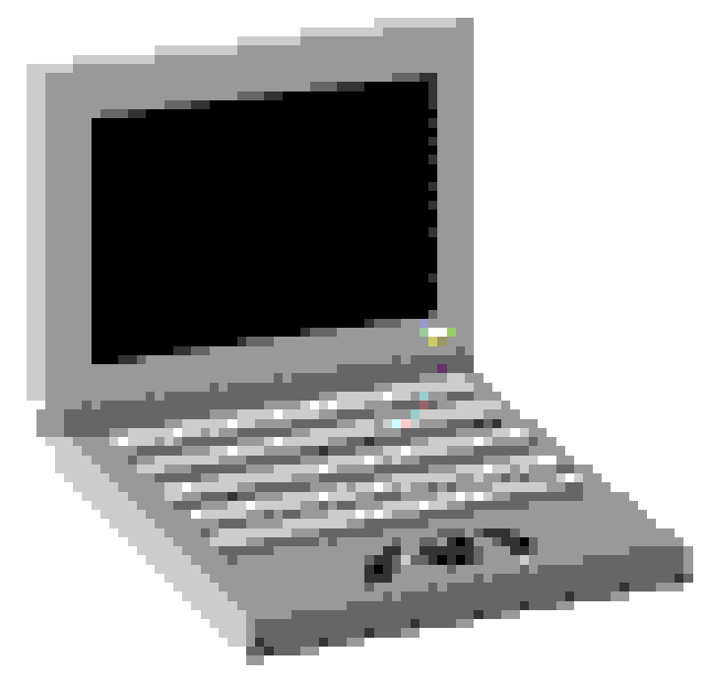

 

░░░░░░░░░░░░░░░░░░░░░░░░░░░░░░░░░░░░░░░░░░

   <table> <tr> <td width="300" valign="top"> <table> <tr> <td width="90" valign="middle" align="center">  </td> <td valign="middle">

developer · tech enthusiast

</td> </tr> </table>

I'm studying Systems Analysis and Development, currently focused on back-end development and programming. I enjoy learning how things work, building projects from scratch, and experimenting with new technologies.

</td> <td valign="top">
  
▓▓▓ 01 — tech stack ▓▓▓
  
             
  

▓▓▓ 02 — currently learning ▓▓▓

      
 </td> </tr> </table>   

░░░░░░░░░░░░░░░░░░░░░░░░░░░░░░░░░░░░░░░░░░

 

thanks for stopping by ♡

